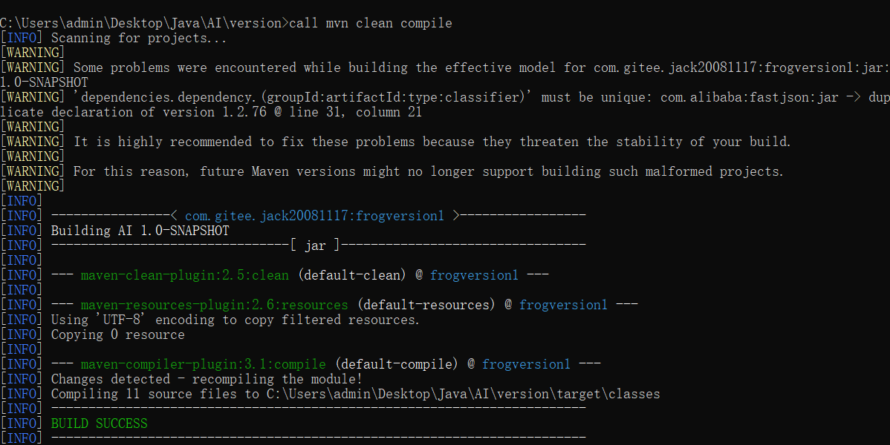
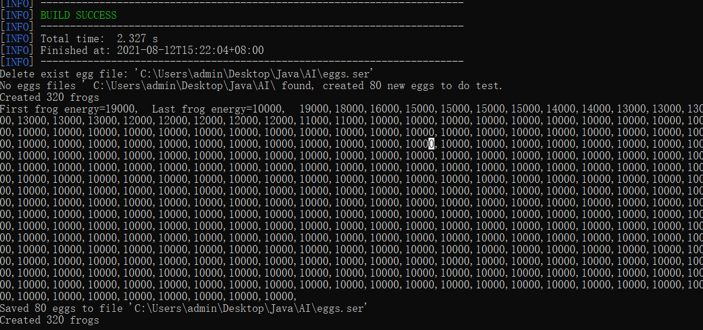

## AI|人工生命
一个基于Java的人工智能生命项目，分为三个模块：

* Application模块：项目的启动、关闭等基础服务
* Env模块：模拟的生物生存区域，将由Programmer全权控制，随着Frog的脑进化变得越来越复杂。
* Frog模块：人工生命的主体，目前具备以下器官：
  * 运动器官：只有4个动作：Up，Down，Left，Right
  * 进食器官：当Frog的坐标与Food的坐标重合的时候，Food会被删除，并增加Frog的能量值。能量值将随着时间流逝减少，耗尽时Frog死亡
  
## 目前进展和成绩
2021.8.11 Virtual Environment 已经搭建完毕，可以模拟最低级的遗传，繁殖，变异，进化现象，但只能向一个方向运动。
相当于一个单细胞“草履虫”，不具备视觉能力，不具备自动找食能力。

运行Version-1分支下的AI\version\run.bat可得到结果。(注意：需要安装Maven和最新版的Java16)

从运行结果来看，每次测试都会有青蛙跑的飞快，这是自然选择的结果，跑的快的青蛙吃得多。

## 重要参数|Parameters
在Env.java中有如下重要参数：
* ENV_XSIZE,ENV_YSIZE:运行时屏幕的长度，宽度
* DELETE_EGGS: 每次运行是是否先删除egg.ser中保存的蛋

## 出现问题|Issues
阅读不明白可以看”对于每个类的细致说明.md“,仍然看不懂可以在评论区留言或提交Issue。

# 谢谢支持！