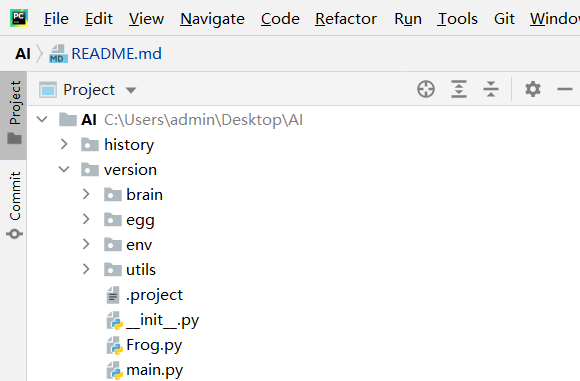
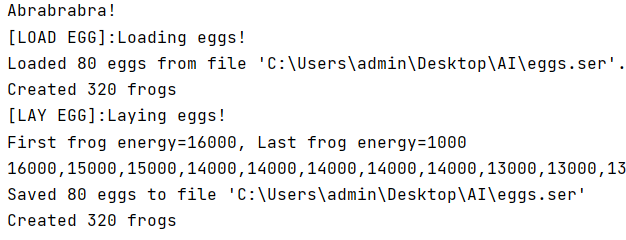
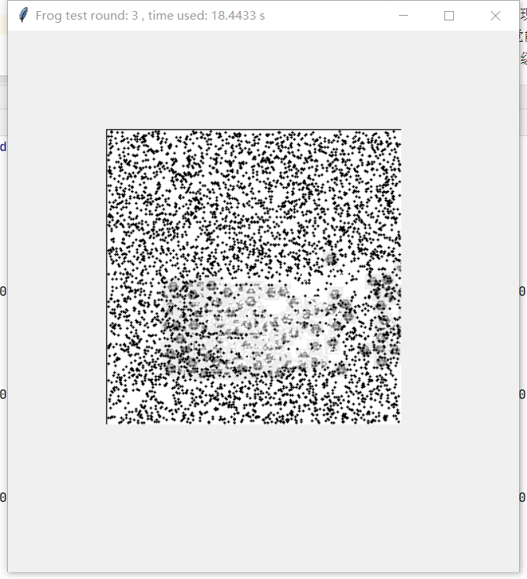

## AI|人工生命
一个基于Python的人工智能生命项目，分为三个模块：

* Application模块：项目的启动、关闭等基础服务
* Env模块：模拟的生物生存区域，将由Programmer全权控制，随着Frog的脑进化变得越来越复杂。
* Frog模块：人工生命的主体，目前具备以下器官：
    * 运动器官：只有4个动作：Up，Down，Left，Right
    * 进食器官：当Frog的坐标与Food的坐标重合的时候，Food会被删除，并增加Frog的能量值。能量值将随着时间流逝减少，耗尽时Frog死亡
    
## 目前进展和成绩
2021.9.13 Virtual Environment 已经搭建完毕，可以模拟最低级的遗传，繁殖，变异，进化现象，但只能向一个方向运动。
相当于一个单细胞“草履虫”，不具备视觉能力，不具备自动找食能力。
运行速度由于Python语言的本身特性（高级语言运行速度较慢）而略微卡顿，希望理解

运AI\history\version1\main.py可得到结果。(注意：在Pycharm上以根目录为AI运行，否则会显示ImportError!)
附图一张：

两张运行图：

2021.9.14 更新了青蛙图片

2021.9.19 父亲大人见我的电脑太脏，洗了一下；然后悲剧发生了——电脑进水了！目前正在维修中（感谢gitee让我保存了代码！）于是我把代码移到了另外一台电脑上。
因此文件目录会有变化，请谅解。

## 正在研发的目标
脑图 BrainStructure.py,可以在上面直观地反映出每次能量最多的First frog的大脑结构图，但是不巧的是脑图无法显示。

# 谢谢支持！