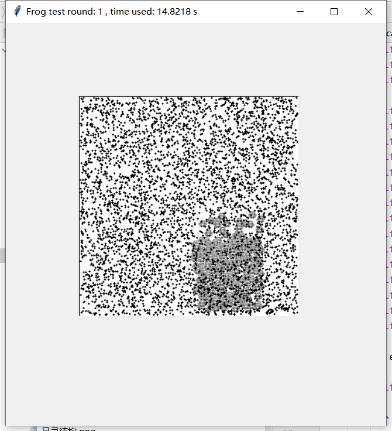

## AI|人工生命
一个基于Python的人工智能生命项目。

## Architecture|项目架构
项目分为三个模块：
* Application模块：项目的启动、关闭等基础服务
* Env模块：模拟的生物生存区域，将由Programmer全权控制，随着Frog的脑进化变得越来越复杂。
* Frog模块：人工生命的主体，目前具备以下器官：
    * 运动器官：只有4个动作：Up，Down，Left，Right
    * 进食器官：当Frog的坐标与Food的坐标重合的时候，Food会被删除，并增加Frog的能量值。能量值将随着时间流逝减少，耗尽时Frog死亡

使用软件：Pycharm     

## 目前进展和成绩
2021.9.13 Virtual Environment 已经搭建完毕，可以模拟最低级的遗传，繁殖，变异，进化现象，但只能向一个方向运动。
相当于一个单细胞“草履虫”，不具备视觉能力，不具备自动找食能力。

运行速度由于Python语言的本身特性（高级语言运行速度较慢）而略微卡顿，希望理解

目前正在尝试使用异步IO加快程序速度，减少卡顿

运行AI\history\version1\main.py可得到结果。(注意：在Pycharm上以根目录为AI运行，否则会显示ImportError!)
附图一张：
<p></p>
两张运行图：
<p></p>
<p></p>

## 重要参数|PARAMETERS
在根目录下的configs.py中有一些重要参数，请勿随意更改
```python
# Speed of test
SHOW_SPEED=1
# Steps of one test round
STEPS_PER_ROUND=10
DELETE_EGGS=False#每次运行是否先删除保存的蛋
# 屏幕的长和宽
ENV_XSIZE=300
ENV_YSIZE=300
FROG_BRAIN_LENGTH=1000
FOOD_QTY=5000#食物总量
EGG_QTY=80#蛋总量
```

# 谢谢支持！